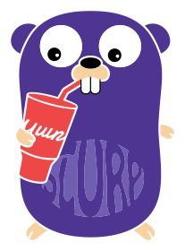
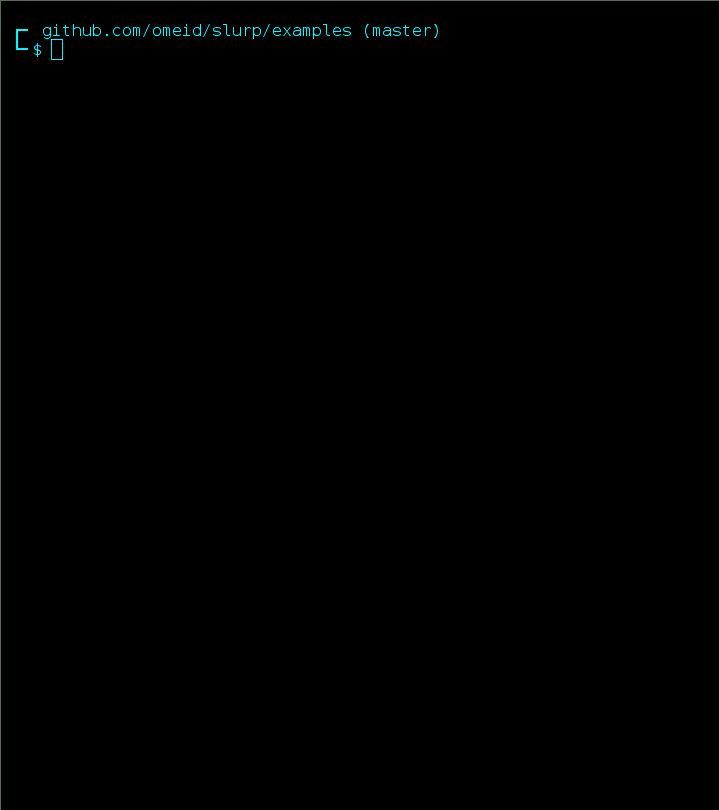

<p align="center">

</p>


# Slurp 
Building with Go, easier than a slurp.

[](https://godoc.org/github.com/omeid/slurp)

> Heads up! while the API is fairly stable now, slurp is still actively developed.


Slurp is a [Gulp.js](http://gulpjs.com/) inspired build toolkit designed with idiomatic Go [Pipelines](http://blog.golang.org/pipelines) and following principles: 

- Convention over configuration
- Explicit is better than implicit.
- Do one thing. Do it well.
- ...

### Use Case
- Web App Development
- Log Analysis
- Continuous Integration
- ...

### Why?
Slurp was born out of frustration with the current state of affaris with building web applications in general, and along with Go specially. 

Before I explain further, I would like to clarify that even though I personally use Slurp mostly for building web apps, slurp itself stays unopinionated about it's usecases, if you're working with and/or processing Files and would like to automate it, Slurp should be able to give you a helping hand.

Building frontend involves a good deal of preprocessing, some out of necessity (conctanation and minification of assets, css prefix) and some for convenience (light languages that compiles to html,css, or JavaScript), the current practical options almost always require 3rd party package mangers even for the most basic tasks like downloading a simple dependency and requires a runtime in one way or another.

Here is the key features that I want but couldn't find any build system that Slurp satisifies:

##### Minimal Dependency
- Gulp.js and Grunt require Node.js as runtime and require npm and sometimes bower for dependency.
- Make requires the make runner and dependencies management differs per project. 

- Slurp promotes using of go implementation of build dependencies, they will be automatically downloaded when you go get a project. 
For project dependencies Slurp takes the simplest approach, use the canonical internet paths. Duhhhh, URLs.

For example, like so 

```go
web.Get( 
  /* list of urls */
).Then(
  archive.Unzip(c), 
  fs.Dst("frontend/libs")
)
```
No need for any bower.json, package.json or bower or npm, or Node.js.

On top of all this, you can distribute your build as a binary, then you don't even need the Go toolchain anymore; Some ideal examples are commercial website templates, static site/blog generators.

##### Cross Platform
- Makefiles, oh boy.
- Slurp is Cross-Platform.

##### Declarative
- Grunt and Make, don't ask.
- Slurp is trying it's best to archives this, please look at the examples.


---


Slurp is made of two integral parts:

### 1. The Toolkit 

    The slurp toolkit provides a task harness that you can register tasks and dependencies, you can then run these tasks with slurp runner.

    A task is any function that accepts a pointer to `slurp.C` (Slurp Context) and returns an error.  
    The Context provides logging functions. _it may be extended in the future_.

    ```go
    b.Task("example-task", []string{"list", "of", "dependency", "tasks"},

        func(c *slurp.C) error {
        c.Info("Hello from example-task!")
        },

        )
    ```

    Following the Convention Over Configuration paradigm, slurps provides you with a collection of nimble tools to instrument a pipeline.

    A pipeline is created by a source _stage_ and typically piped to subsequent _transformation_ stages and a final _destination_ stage.

    Currently Slurp provides two source stages `slurp/stages/fs` and `slurp/stages/web` that provide access to file-system and http source respectively.

    ```go
    b.Task("example-task-with-pipeline", nil , func(c *slurp.C) error {
        //Read .tpl files from frontend/template.
        return fs.Src(c, "frontend/template/*.tpl").Pipe(
          //Compile them.
          template.HTML(c, TemplateData),
          //Write the result to disk.
          fs.Dest(c, "./public"),
          ).Wait() //Wait for all to finish.
        })
```

or the same code shorter

```go
b.Task("example-task-with-pipeline", nil , func(c *slurp.C) error {
    //Read .tpl files from frontend/template.
    return fs.Src(c, "frontend/template/*.tpl").Then(
      //Compile them.
      template.HTML(c, TemplateData),
      //Write the result to disk.
      fs.Dest(c, "./public"),
      )
    })
```

and another example,

    ```go
    // Download deps.
    b.Task("deps", nil, func(c *slurp.C) error {
        return web.Get(c,
          "https://github.com/twbs/bootstrap/archive/v3.3.2.zip",
          "https://github.com/FortAwesome/Font-Awesome/archive/v4.3.0.zip",
          ).Then(
            archive.Unzip(c),
            fs.Dest(c, "./frontend/libs/"),
            )

        })
```

Currently the following _stages_ are provided with Slurp:
> No 3rd party dependency, just standard library.  

- [archive](https://godoc.org/github.com/omeid/slurp/stages/archive/)
- [fs](https://godoc.org/github.com/omeid/slurp/stages/fs/)
- [passthrough](https://godoc.org/github.com/omeid/slurp/stages/passthrough/)
- [template](https://godoc.org/github.com/omeid/slurp/stages/template/)
- [web](https://godoc.org/github.com/omeid/slurp/stages/web/)


You can find more at [slurp-contrib](https://github.com/slurp-contrib). gin, gcss, ace, watch, resources (embed), and livereload to name a few.


### 2. The Runner (cmd/slurp)

This is a cli tool that runs and help you compile your builders. It is go get’able and you can install with:

```bash
$ go get -u -v github.com/omeid/slurp/cmd/slurp  # get it.
```

Slurp uses the Slurp build tag. That is, it passes `-tags=slurp` to go tooling when building or running your project,
      this allows decoupling of build and project code. This means you can use Go tools just like you're used to, even if your
      project has a slurp file.

      Somewhat similar to `go test` Slurp expects a `Slurp(*slurp.Build)` function from your project, this is typically put in a file with the `// +build slurp` build tag.

### Demo 



### Contributing

Please see [Contributing](CONTRIBUTING.md)

### Examples
  - The obligatory [Todo App (Slurp)](https://github.com/omeid/slurp-todo)


### LICENSE
  [MIT](LICENSE).
